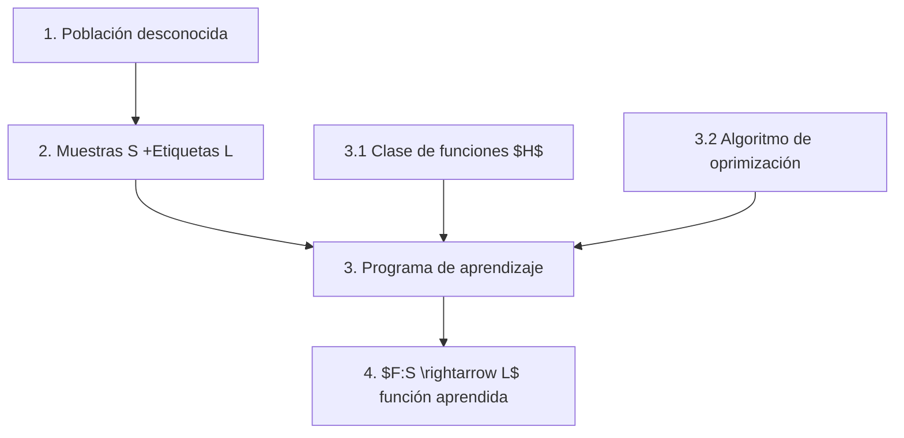

El objetivo es aprender una función desconocida $f$ con:
?
	1. Muestras de datos
	2. El valor de la función para cada uno de los datos (etiqueta)

Me cago en falete
**Asume**:
	1. La única información disponible es la de la muestra
	2. Se puede aproximar a $f$ a través de algún criterio de aprendizaje
	3. *Objetivo*:: Encontrar una función $g$ que aproxime a $f$ no solo para el dataset de entreno sino para toda la población

## Formalización:
![[Pasted image 20230419125947.png]]

### 1. El Dataset
?
- Los datos vienen, desde el punto de vista matemático de una distribución de probabilidad $P(D)$
- Se presupone que los datos están *independientemente e identicamente distribuidos*.
- Hola manolo

### 2. Objetivo
- Tareas de predicción:$$f:X \rightarrow Y \text{ (Labels)}$$
 
### 3. El modelo
?
- Se escoge una clase de función, del conjunto de todas las funciones: $H$ 
- Como caracterizamos cada elemento de $h \in H$ -> Parámetros, arquitectura ... 

### 4. El algoritmo de aprendizaje -> Buscando dentro de $H$?
?
- Criterios óptimos para asegurar el aprendizaje $A$:
	1. ERM -> [[Empirical Risk Minimization]]
	2. SRM -> [[Structural Risk Minimization]]
	3. Medida de Similaridad?

## Proceso del Aprendizaje Supervisado

1. Recibimos la descripción del Dominio del dataset y de las etiquetas así como el dataset.
2. Elegimos el Conjunto hipótesis con los tipos de funciones que probablemente representen a f
3. Extraemos una muestra del dataset
4. Elegimos un algoritmo de aprendizaje A, le pasamos la muestra para que nos devuelva una hipótesis $g \in H$
5. Comprobamos que $g \approx f$
