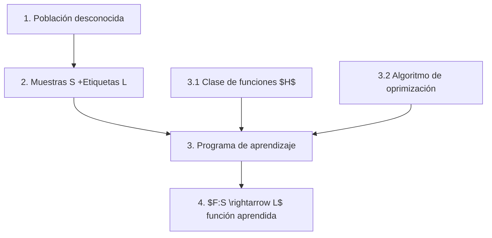

El objetivo es aprender una funcion desconocida $f$ con:
	1. Muestras de datos
	2. El valor de la función para cada uno de los datos (etiqueta)
**Asume**:
	1. La unica información disponible es la de la muestra
	2. Se puede aproximar a $f$ a travesd e algún criterio de aprendizaje
	**Objetivo**:: Encontrar una función $g$ que aproxime a $f$ no solo para el dattaset de entreno sino para toda la población

## Formalización:
![[Pasted image 20230419125947.png]]
