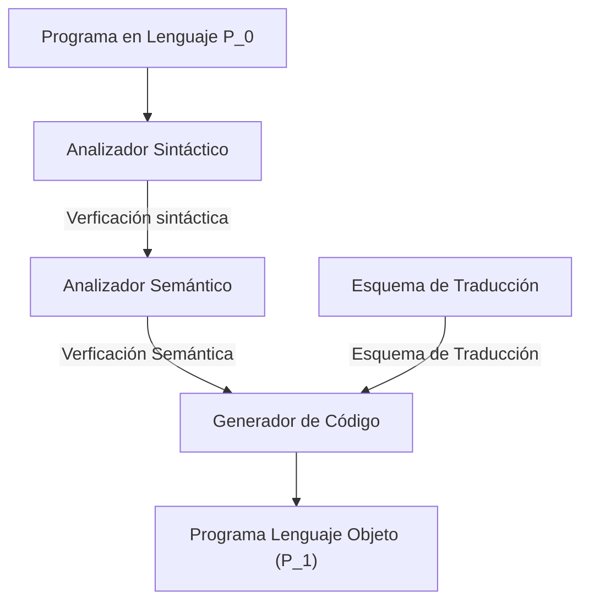

>[!important] De donde empezamos: 
>- Dados dos modelos semánticos
>	1. $M_1 = (L_1(G_1),D_1,I_1)$
>	2. $M_2 = (L_2(G_2),D_2,I_2)$
>

![[3 Visión general de un traductor-20241028174257809.webp]]

**Fases del proceso de traducción:**
?
1. [[#Fase de análisis, problemas y restricciones de aplicación|Análisis (*front-end*)]]
	1. [[#Verificación Sintáctica]]
		1. [[#Análisis léxico]]
		2. [[#Análisis sintáctico]]
	2. [[#Verificación semántica]]
		1. [[#Análisis semántico]]
2. [[#Fase de síntesis|Síntesis (*back-end*)]]
	1. [[#Generación de Código]]
	2. [[#Optimización de Código]]

>[!seealso]- Verificación semántica
> Consiste en comprobar que lo escrito tenga sentido, aunque esté bien escrito sintácticamente, es decir, (en el contexto de los lenguajes de programación) que no existen variables sin declarar, que no se usen tipos de datos ni identificadores que estén fuera del contexto... 

## Fase de análisis, problemas y restricciones de aplicación

### Verificación Sintáctica

>[!info] La verificación sintáctica se puede resumir en:
>1. Elegir lenguajes que estén definidos por **gramáticas regulares (tipo 3)** o **gramáticas independientes del contexto (tipo 2)**
>2. Diseñar lenguajes formador como concatenación de palabras y las palabras formadas como concatenación de símbolos de un alfabeto.

Si las frases obedecen a una estructura sintáctica, la verificación se puede descomponer en:
1. [[#Análisis léxico]]
2. [[#Análisis sintáctico]]

#### Análisis léxico

El objetivo del analizador léxico es el de identificar distintos tokens y asignarles una misión sintáctica.

>[!def] Componente léxico(símbolo o token)
>Conjunto de palabras que hacen la misma misión sintáctica.
>>[!example]-
>>- Verbos, Sujetos (Lengua castellana)
>>- Identificadores, Palabras reservadas, Tipos (Lenguaje de Programación)
>
>Los tokens son definidos por expresiones regulares

>[!def] Lexema
>Cada palabra concreta del texto fuente asociado a un token

>[!def] Patrón
>Regla mediante la cual una secuencia de caracteres del texto fuente es asociado a un token (regla de formación de un token). Cada patrón es reconocido por un Autómata Finito Determinista (AFD)

>[!example]
>![[3 Visión general de un traductor-20241104191128294.webp]]

Desde un punto de vista del **análisis sintáctico**, se obvia el lexema de cada componente léxico, solo nos interesa la presencia de un determinado componente léxico. Pero desde la perspectiva del análisis semántico y de generación de código, se necesita conocer el lexema concreto. Para solucionar este problema, se introducen los lexemas en una tabla de símvolos y se censerva, para cada token, un atributo que indica el token en concreto que representa.

>[!seealso]- Herramientas para contruir un analizador léxico
>1. [LEX](https://silcnitc.github.io/lex.html)

#### Análisis sintáctico

Se verifica la sintaxis de la secuencia de palabras. Para ello se pueden aplicar **técnicas predictivas** sin vuelta *a atrás*. La complejidad del análisis sintáctico depende del tipo de gramática usada para representar el lenguaje. 

>[!seealso]- Gramática
>![[3 Visión general de un traductor-20241104192707088.webp]] 
>![[3 Visión general de un traductor-20241104192722281.webp]]

>[!important] Clasificación Gramáticas
>![[3 Visión general de un traductor-20241104192904435.webp]]

#### Análisis sintáctico predictivo

Para asegurar que una cadena de símbolos pertenece a un lenguaje, es necesario aplicar todas las combinaciones posibles sobre las producciones de la gramática y comprobar si puede generarse.

>[!def] Abstracción léxica
>Proceso de simplificación de la gramática original a otra con un menor número de símbolos. La denominaremos Gramática abstracta.

>[!important] Estrategias de análisis de producciones:
>1. Ascendente
>	1. Precedencia
>	2. LR
>	3. SLR
>	4. LALR
>2. Descendente
>	1. LL

El proceso de análisis predictivo permite, ante un símbolo de entrada, decidir que hacer para proseguir el análisis y obtener una cadena del lenguaje, sin tener que generar todas las posibles cadenas del lenguaje.

### Verificación Semántica

#### Análisis semántico

Desde el árbol sintáctico (secuencia de producciones aplicadas en el análisis) podemos identificar la secuencias de componentes léxicos con significado conjunto. Ya que partimos de una secuencia de componentes léxicos correcta sintácticamente, podemos analizar el valor semántico estructurado asociado con cada subsecuencia de componentes léxicos junto con su argumentos.

En el ejemplo anterior, tenemos dos símbolos no terminales de la gramática que identifica secuencias de entrada con significado conjunto: 

>[!example]
>C → if E then S ---------→ C → IF E THEN S 
>A → id := E ---------→ A → ID ASIGN E  

Al aplicar la producción A $\rightarrow$ ID ASIGN E, debemos comprobar que el lexema asociado con ID debe ser del mismo tipo que el de la expresión E. Esto nos facilita completar la información acerca de los lexemas. Nos permite completar la información de la tabla de símbolos. Sería el equivalente a que la frase tenga sentido en un lenguaje hablado. Ya no solo que sea correcta, sino que tenga sentido.

## Fase de síntesis

### Generación de Código

Consiste en aplicar de forma particularizada el [[1 Conceptos Previos#Esquema de Traducción|Esquema de Traducción]] para cada secuencia de lexemas con sentido propio. Un aspecto importante en los traductores de lenguajes de programación consiste en que ==deben generar códigos de una eficiencia comparable al generado directamente en lenguaje máquina==. Esta cualidad deseable de los traductores ha dado lugar al desarrollo de técnicas de optimización de código.

### Optimización de Código

Toda secuencia de programa obtenido en código máquina u objeto se caracteriza por la presencia de:
- Instrucciones de asignación 
- Instrucciones de evaluación 
- Instrucciones de control 
En ocasiones es posible reorganizar el código para reducir el número de instrucciones

## Modelo general de un traductor
![[3 Visión general de un traductor-20241105112212435.webp]]
![[3 Visión general de un traductor-20241105112252751.webp]]
![[3 Visión general de un traductor-20241105112310697.webp]]
