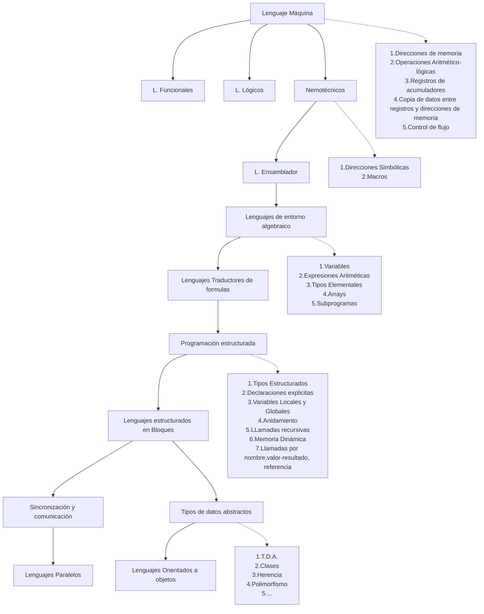

## Evolución de los lenguajes de programación

![[4 Tipos y evolución de los traductores-20241105114422110.webp]]

## Evolución de los traductores

## Compiladores

>[!important]
>Los compiladores obtienen una especificación en lenguaje máquina equivalente a la del lenguaje original
 
![[Pasted image 20241105115738.webp]]

La fase de compilación se puede dividir en:
**Compilación**::Traduce la especificación de entrada a lenguaje máquina incompleto y con instrucciones máquina incompletas.
**Enlazador**::Enlaza los programas objetos y completa las instrucciones máquina incompletas, generando un ejecutable.
## Intérpretes

>[!important]
>Un intérprete carga la especificación de un programa en lenguaje no máquina y la interpreta y ejecuta, instrucción a instrucción.

![[Pasted image 20241105115929.webp]]

