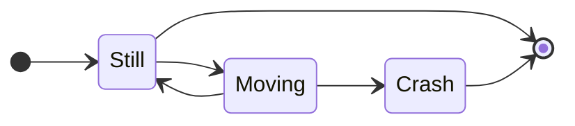

## Procesos y hebras

![[Proceso#^ptyusz]]

### Funcionalidades asociadas a los procesos

#### Creación y eliminación:

*Instanciación* y *eliminación* del PCB asociado al un programa que va a ejecutarse/ejecutado

#### Bloqueo y Desbloqueo

*Pausa* y *Continuación* procesos dependiendo de los eventos por los que debe esperar un programa para poder continuar su ejecución.

#### Sincronización

La existencia de mecanismos dentro del SO para que los procesos se *comuniquen* y se *sincronicen*

## Funcionalidad para memoria

