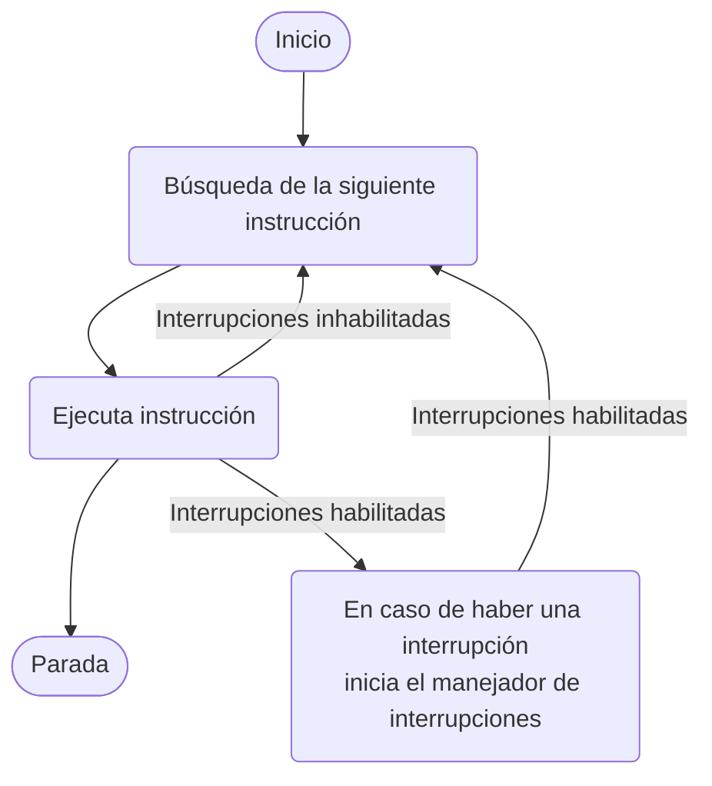

## CPU

![[Pasted image 20241009190320.png]]

- Registros internos: 
	-  Registro de dirección de memoria, MAR, que contiene la siguiente instrucción R/W.
	-  Registro de buffer de memoria, MBR, contiene los datos que van a escribirse en memoria o recibe los datos que se leerán de memoria. 
	-  I/O address register, I/O AR, registro de dirección E/S. 
	-  I/O buffer register, I/O BR, registro de buffer E/S. 
- Registros de propósito general: pueden ser accedidos por los programas y se clasifican en registros de datos y registros de direcciones (registro de índices, puntero a segmento y puntero a pila). 
- Otros registros:
	- PC. Contiene la dirección de la siguiente instrucción. 
	- IR. Contiene la última instrucción que se fue a buscar. 
	- PSW. Contiene códigos de condición, información para interrupciones y modo de ejecución al procesador

## Memoria Principal (RAM)

Es modelo abstracto que representa un array lineal compuesto por un número de palabras con un tamaño. Las palabras son direccionables con números naturales empezando desde el 0, cada número es la dirección de memoria de la correspondiente palabra. El conjunto de números que  representa las direcciones de memoria se llama espacio de direcciones. La memoria hace operaciones de lectura y escritura. 

Las direcciones se codifican en base 2, si utilizamos $n$ bits para codificar las direcciones tendremos un espacio de direcciones con cardinalidad $2^n$. Para obtener el tamaño de la memoria multiplicamos el número resultante por el tamaño de palabra.

>[!seealso]- Ancho del bus de direcciones y tamaño de la memoria
>Normalmente el ancho del bus de direcciones determina el númerro de bits que codifican el espacio de direcciones.

## Módulos de E/S

## Principales técnicas de E/S

![[Pasted image 20241009191212.png|700| Diferen]]

## Interrupciones

### Ciclo de ejecución de instrucción con interrupciones

### Manejador de interrupciones:

![[Pasted image 20241009192256.png]]

## Modos de Ejecución

>[!important]
>En respuesta a una llamada al sistema (interrupción software) solicitada explícitamente por el programa en ejecución (pej. syscall en IA-32), el HW apila PSW y PC actuales, activa modo kernel, y carga el PC con el contenido del vector correspondiente al gestor general de llamadas.

