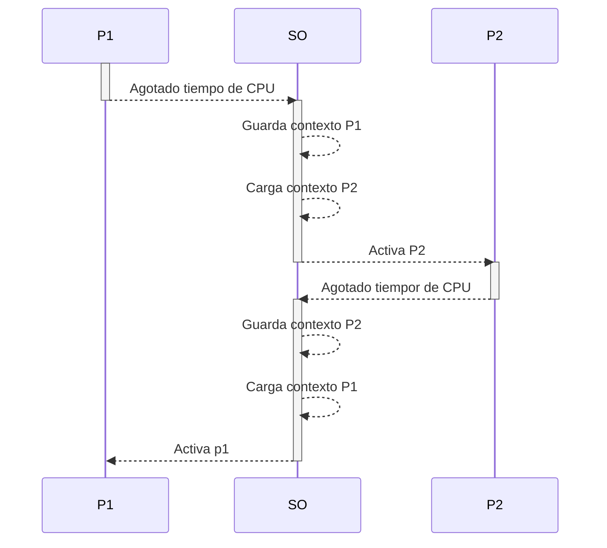
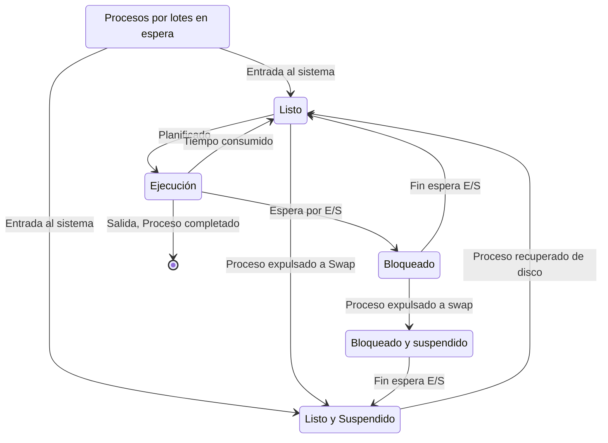

# Descripción y control de procesos

- [[#Modos de ejecución|Modos de ejecución]]
	- [[#Modos de ejecución#Código del kernel (Fuera de todo proceso)|Código del kernel (Fuera de todo proceso)]]
	- [[#Modos de ejecución#Ejecución dentro de procesos de usuario|Ejecución dentro de procesos de usuario]]
- [[#PCB (Process Control Block)|PCB (Process Control Block)]]
	- [[#PCB (Process Control Block)#Cambio de Contexto:|Cambio de Contexto:]]
- [[#Estados de un proceso:|Estados de un proceso:]]
	- [[#Estados de un proceso:#Modelo de procesos de 5 estados con memoria Swap|Modelo de procesos de 5 estados con memoria Swap]]
	- [[#Estados de un proceso:#Creación de procesos|Creación de procesos]]
		- [[#Creación de procesos#Por qué crear un proceso|Por qué crear un proceso]]
	- [[#Estados de un proceso:#Por qué acabar un proceso|Por qué acabar un proceso]]
	- [[#Estados de un proceso:#Procesos suspendidos|Procesos suspendidos]]
		- [[#Procesos suspendidos#Razones para la suspensión de procesos|Razones para la suspensión de procesos]]

Los requisitos que un SO debe cumplir (con referencia a los procesos) se expresan de la siguiente manera: 
- El SO debe intercalar la ejecución de múltiples procesos, para maximizar la utilización del procesador mientras se proporciona un tiempo de respuesta razonable.
- El SO debe reservar recursos para los procesos conforme a una política específica mientras que, al mismo tiempo, evita interbloqueos.
- Un SO puede requerir dar soporte a la comunicación entre procesos y la creación de procesos, mediante las cuales ayuda a la estructuración de las aplicaciones.

>[!def] ***Proceso***
>?
>- Un programa en Ejecución
>- Una Instancia de un programa ejecutado en un computador
>- La entidad que puedes asignar y ejecutar en un procesador
>- Una unidad de actividad que se caracteriza por la ejecución de una secuencia de instrucciones, un estado actual y un conjunto de recursos asociados
^ptyusz

También puede expresarse como una entidad que consiste en un número de elementos. Los dos elementos esenciales serían el **código de programa** y un **conjunto de datos asociados a dicho código**. Además, supiongamos que el procesador empieza a ejecutar este código de programa, esta entidad se denomina **proceso**.

## Modos de ejecución

Con respecto a la ejecución en CPU ser utilizan dos niveles de privilegio (modos de ejecución): **usuario** y **kernel**.

>[!seealso]- ¿En qué modo de ejecución estoy?
> Para saber en que modo de ejecución se está ejecutando, existe un bit en la palabra/registro de estado que indica el modo de ejecución. Otras arquitecturas contienen un registro de dos bits que indica el nivel de privilegios en el que se está corriendo (0 -> Mayor Priv, 3 -> Menor Priv). 

### Código del kernel (Fuera de todo proceso)
- Es la ejecución del propio kernel. Se ejecuta fuera de todo proceso.
- El código del SO se ejecuta como una entidad separada y opera en modo privilegiado todo el rato.
- El código de este espacio ha de ser [reentrante](https://es.wikipedia.org/wiki/Seguridad_en_hilos#:~:text=Código%20reentrante%3A%20Básicamente%2C%20escribir%20código,continuar%20con%20su%20tarea%20original.)
	- Que no ha de depender ni almacenar estados en variables globales (No efectos colaterales)

### Ejecución dentro de procesos de usuario
- Software del SO en el contexto de una llamada de usuario (llamada para mandar texto a la terminal...)
- Un Proceso se ejecuta en modo privilegiado cuando se ejecuta el código del SO.

## PCB (Process Control Block)

![[Pasted image 20241014114827.png|Imagen del PCB de un proceso (Entornos Linux)]]  ^2jxi3b

 En cualquier instante puntual de tiempo, *mientras que el proceso está en ejecución*, este proceso se puede caracterizar por:
 1. Un identificador único (**PID -> Process IDentificator**)
 2. Un **Estado** (corriendo, parado...)
 3. **Contador de programa** -> Dirección de memoria de la siguietne instruccuión a ejecutar.
 4. **Varios Punteros a Memoria** -> incluye los punteros al código del programa y a los datos asociados a dicho proceso, además, cualquier bloque de memoria compartido por otros procesos.
 5. **Datos de Contexto** -> Registros del procesador en un momentos dado
 6. **Información de estado de E/S** -> incluye las peticiones pendientes de E/S, los dispositivos asignados, una lista de ficheros usados por el mismo.
 
 Toda esta información se almacena en una Estructura de Datos denominada [[Proceso#^2jxi3b|PCB (Process Control Block)]]. Esta estructura es la que permite al SO la multiprogramación ya que es capaz de parar y continuar cualquier proceso sin perdida de información, como si no hubiera ocurrido.

### Cambio de Contexto:

Cuando un proceso se esta ejecutando, toda su información de contexto esta cargado directamente en la CPU. En el momento en el que el SO inicia el proceso de parar la ejecución de un proceso, ==guarda los valores actuales de contexto en el PCB de dicho proceso==. 

La acción de conmutar la CPU de un proceso a otro se denomina **Cambio de Contexto**. Los sistemas de tiempo compartido realizan de 10 a 100 cambios de contexto por segundo. Este trabajo extra se denomina **Sobrecarga**.

## Estados de un proceso:

### Modelo de procesos de 5 estados con memoria Swap

![[Pasted image 20241014125812.png| Modelo de estados de un proceso. Imagen diagrama de estados]]

### Creación de procesos

Una vez que el sistema operativo decide crear un proceso, procederá de la siguiente manera:
1. Asignar un identificador de proceso único al proceso. En ese instante se añade una nueva entrada a la tabla primaria de procesos que contiene una entrada por proceso.
2. Reservar espacio para proceso. Para ello el SO debe conocer cuanta memoria se requiere para el espacio de direcciones privado (Programas+datos) y la pila de usuario. Por último se debe reservar espacio para el PCB.
3. Inicialización del bloque de control de proceso. Es la información del estado del proceso, habitualmente se inicializa con la mayoría de entradas a 0, excepto por el `PC` y los `Punteros de Pila del sistema`. La información de control de procesos se inicializa en base a los valores por omisión, considerando también los atributos que han sido solicitados para este proceso. La prioridad se puede fijar por defecto, a la mas baja, a menos que una solicitud explicita la eleve a una prioridad mayor. Inicialmente el proceso no debe poseer ningún recurso a menos que exista una indicación explicita o que haya sido heredado del padre.
4. **Establecer los enlaces apropiados**. Por ejemplo, si el SO mantiene cada cola del planificador como una L.E. el proceso ha de colocarse en la lista de **Listos** o en la lista de **Listos/Suspendidos**
5.  Creación o expansión de otras estructuras de datos, por ejemplo, el SO puede mantener un registro de auditoría por cada proceso que se puede utilizar posteriormente a efectos de facturación y/o análisis de rendimiento del sistema.

#### Creación de Procesos en **UNIX-LIKE OS**

- La llamada a `fork()` crea a un proceso nuevo
	- El nuevo proceso hereda una copia de la memoria del proceso padre
	- El nuevo proceso una copia de los registros del proceso del padre
	- Los procesos padre e hijo se ejecutan en el mismo punto de ejecución de fork, y por convención:
		- `fork()` = 0 en el proceso hijo
		- `fork()` = id en el proceso padre, y es el identificador de proceso del proceso hijo. 
- La llamada a `exec()` reemplaza el espacio de direcciones del proceso actual, por el del programa pasado como argumento

Si se llama a la función `fork()` seguida de una llamada `exec()`, se consigue unn proceso hijo ejecutando el programa pasado por argumentos. 

#### Por qué crear un proceso

| Motivo                          | Explicación                                                                                                                                                                                                  |
| ------------------------------- | ------------------------------------------------------------------------------------------------------------------------------------------------------------------------------------------------------------ |
| Nuevo Proceso de lotes          | El SO dispone de un flujo de control de lotes de trabajos, habitualmente una cinta, un disco... Cuando el SO está listo para procesar un nuevo trabajo, leerá la siguiente secuencia de mandatos de trabajos |
| Sesión interactiva              | Un usuario se conecta al SO desde una terminal                                                                                                                                                               |
| Creado por el propio SO         | El SO puede crear procesos para realizar una función en representación de un programa de usuario, sin que el usuario tenga que interceder.                                                                   |
| Creado por un proceso Existente | Por motivos de modularidad o para explotar el paralelismo, un programa de usuario puede ordenar la creación de un número de procesos                                                                         |
>[!info] Proceso Padre - Proceso Hijo
>Si un determinado proceso crea otro proceso, al primero se le denomina proceso padre y al segundo proceso hijo.

### Por qué acabar un proceso

| Motivo                               | Explicación                                                                                                                                      |
| ------------------------------------ | ------------------------------------------------------------------------------------------------------------------------------------------------ |
| Finalización normal                  | El proceso ejecuta una llamada a una función que le indica al SO que ha acabado.                                                                 |
| Línea de tiempo excedida             | El proceso ha ejecutado más tiempo del especificado en un límite máximo.                                                                         |
| Memoria no disponible                | El proceso quiere mas memoria de la que el sistema puede ofrecer.                                                                                |
| Violación de Segmento/ Segment Fault | El proceso pide acceder a una dirección de memoria no asignada a dicho proceso.                                                                  |
| Error de protección                  | El proceso trata de usar un recurso, por ejemplo, un fichero, al que no tiene permitido acceder, o trata de utilizarlo de una forma no apropiada |
| Error aritmético                     | El proceso intenta realizar una operación aritmética no permitida (multiplicación por 0, overflow de una palabra...)                             |
| Limite de tiempo                     | El proceso ha esperado mas tiempo que el especificado en un valor máximo para que se cumpla un determinado evento.                               |
| Fallo de E/S                         | Se ha producido un error durante una entrada de E/S.                                                                                             |
| Instrucción no valida                | El proceso intenta ejecutar una instrucción inexistente.                                                                                         |
| Instrucción privilegiada             | El proceso intenta ejecutar una instrucción reservada al SO                                                                                      |
| Uso inapropiado de datos             | Una porción de datos es de tipo erroneo o no se encuentra inicializada                                                                           |
| Intervención del operador por el SO  | Por alguna razón, el operador o el SO ha finalizado el proceso                                                                                   |
| Terminación del proceso padre        | Cuando un proceso padre termina, el SO puede automáticamente finalizar todos los procesos hijos descendientes.                                   |
| Solicitud del proceso padre          | Un proceso padre puede finalizar la ejecución de sus procesos hijos mediante la llamada a `kill()`                                               |

 
 
 

### Procesos suspendidos

Este modelo funciona cuando la informaicón relativa a los procesos no cabe entera en memoria principal y se requiere de almacenamiento secundario para poder operar de una manera óptima. Esta región de la memoria se le denomina swap. 

Con la aparición del swap es cuando se incluyen los dos estados de suspensión, que indican que el proceso esta localizado en disco en vez de en memoria principal.

>[!question]- Un proceso se denomina suspendido si cumple las siguientes características:
>-  No está inmediatamente disponible para ejecutar.
>- El proceso fué puesto en estado de suspensión por algún agente.
>- No se puede recuperar hasta que el propio proceso lo indique.

#### Razones para la suspensión de procesos 
| Razón                             | Explicación                                                                                                                |
| --------------------------------- | -------------------------------------------------------------------------------------------------------------------------- |
| *Swapping*                        | El SO necesita liberar suficiente memoria principal para traer un proceso en estado listo de ejecución                     |
| Otras Razones del SO              | El SO puede suspender un proceso en segundo plano o de utilidad, si existe la sospecha de ejecución de código malicioso... |
| Solicitud Interactiva del usuario | Un usuario puede desear suspender un proceso por cualquier motivo que le atañe (usar un recurso, depurar...)               |
| Temporización                     | Un proceso puede ejecutarse periódicamente y puede suspender mientras espera el siguiente intervalo de ejecución           |
| Solicitud del proceso padre       | Un proceso padre puede querer suspender la ejecución de algún proceso hijo para examinar o modificar dicho proceso.        |

